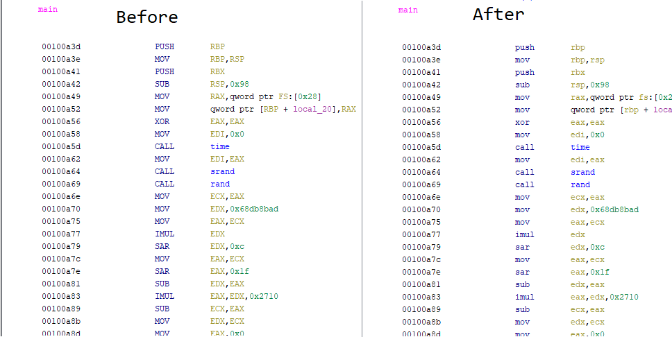
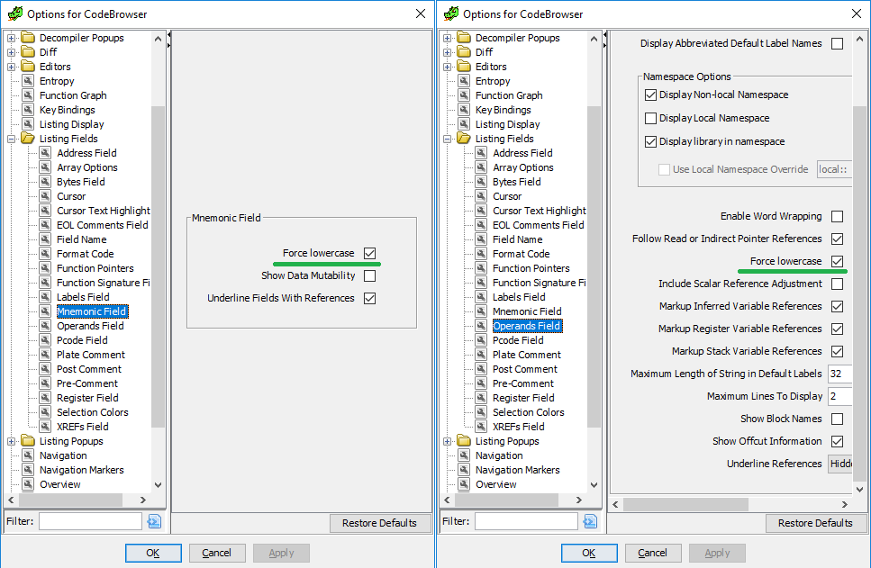

# Ghidra-lowercase
A small modification to Ghidra 9.0 (initial binary release) to allow mnemonics and operands in the listing to be forced to lowercase in an attempt to mimic IDA visuals. 



## Install & Usage
Forewarning: This simply adds ```.toLowerCase()``` calls into code that I have no understanding of. Forcing operands to lowercase in the way that I've done breaks operand highlighting (this is not the case with the mnemonics however).

1. Set the `GHIDRA_INSTALL_DIR` environment variable to your Ghidra install directory.
	- Windows: `set GHIDRA_INSTALL_DIR=G:/ghidra_9.0`
	- Linux: `GHIDRA_INSTALL_DIR=/usr/local/ghidra_9.0`
2. Run `build_and_inject.(bat|sh)`.
	- Linux sh script is entirely untested.
3. Enable the options under `CodeBrowser -> Edit -> Tool Options -> Listing Fields`.



